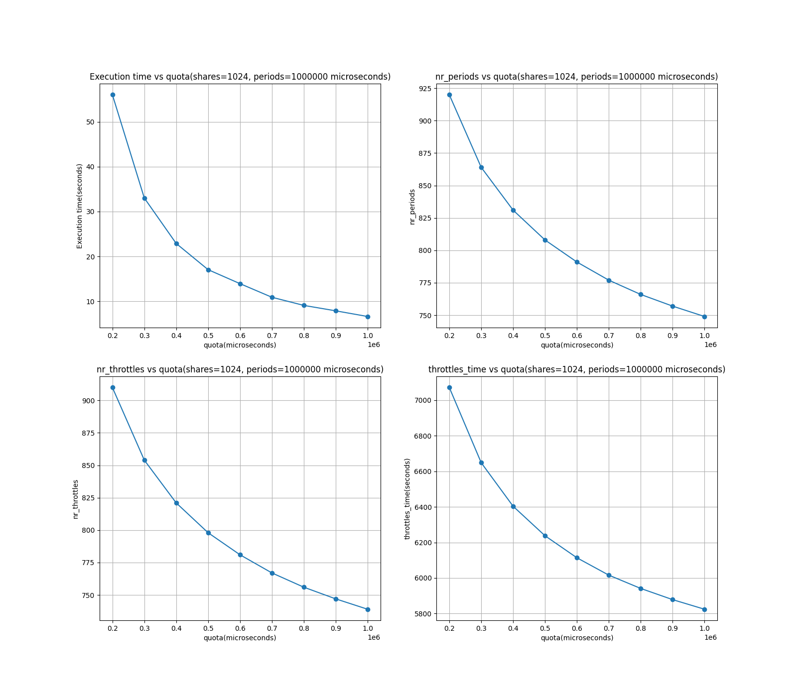
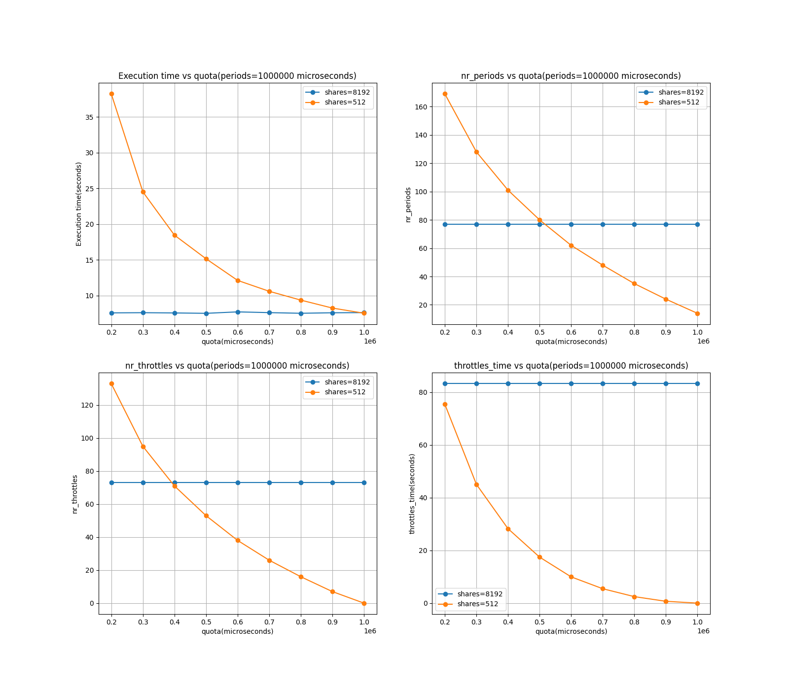

# Part 1

- I have created a file `cpu_intensive.cc` which do some random computation and prints the elapsed time. It also put itself in cgroup called
  `question1` and then run the program.
- Cgroup can be created using `mkdir -p /sys/fs/cgroup/cpu/question1`
- Some Terminology is given in the main [README.md](../README.md) file.
- The graph is generated by first running `result.sh` and then running `python3 graph.py` in the `part1` directory.

- `cpu_intensive.cc` can be found in the `part1` directory.
- We have only one new cgroup and that is `question1`. And we are only running one program in that cgroup.
- As expected all metric decreases as the number quota increases. Since, we have more cpu time to run the program, the program runs faster and hence the elapsed time decreases.

# Part 2
- Two cpu intensive programs are run in two different cgroups. The cgroups are `question1p1` and `question1p2`.
- `cpu_intensive1.cc` and `cpu_intensive2.cc` are the two programs.
- `result.sh` and `graph.py` are used to run the programs and generate the graph.
- `cpu_intensive1.cc`  running in cgroup `question1p1` has a higher cpu shares (8192) than `cpu_intensive2.cc` (512) running in cgroup `question1p2`.
- More share means more cpu time. So, `cpu_intensive1.cc` will get more cpu time than `cpu_intensive2.cc`.
  

- As expected, `cpu_intensive1.cc` takes less time to run than `cpu_intensive2.cc`. This is because `cpu_intensive1.cc` gets more cpu time than `cpu_intensive2.cc`.
- `cpu_intensive1.cc` is mainly unaffected by quota allotted. This is because it gets more cpu time than `cpu_intensive2.cc`.
- `cpu_intensive2.cc` is affected by the quota allotted. This is showing same behavior as in part 1. As the quota increases, the program runs faster and hence the elapsed time decreases.