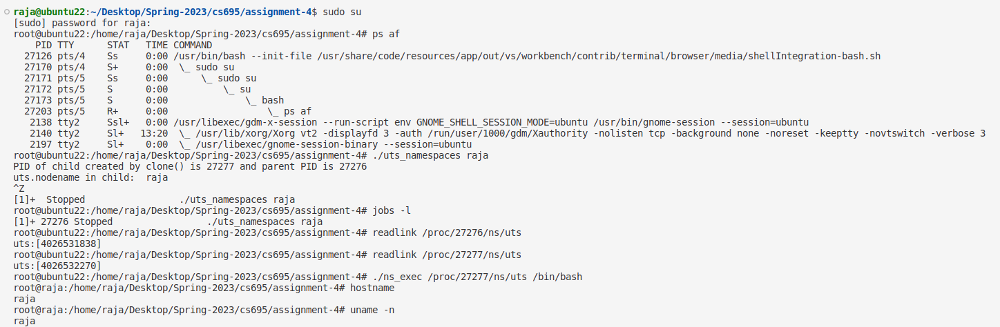
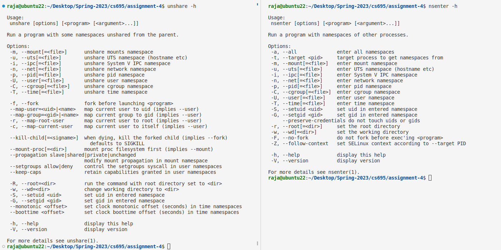
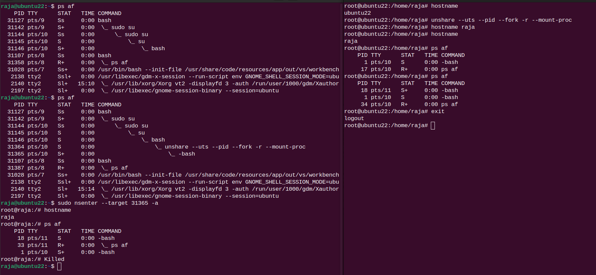
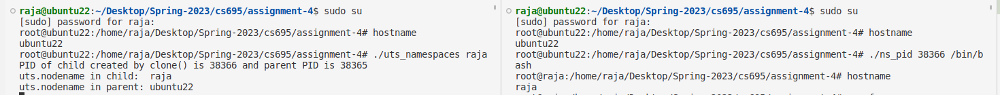

#### Question #2

##### Part a

###### 	demo_uts_namespaces.c and ns_exec.c 

​	

- `demo_uts_namespaces.c` is used to create a new child process with different uts namespaces using `clone`. The child process is created with `CLONE_NEWUTS` flag. The parent process waits for the child process to finish and then exits.
- I have recreated this example as asked in the question. Terminal output is shown in the above image.

##### Part b

- This part is similar to the part a. The only difference is that we are replicating the behavior of part a using `unshare` and `nsenter` command line tools. Terminal output is shown in the above image.

##### part c

- `ns_pid.c` takes a process id as an argument and then join the namespace of the process. It then execute the program passed as an argument in the namespace of the process.
- `ns_pid.c` can be found in the `part3` directory.
- Terminal output is shown in the above image.