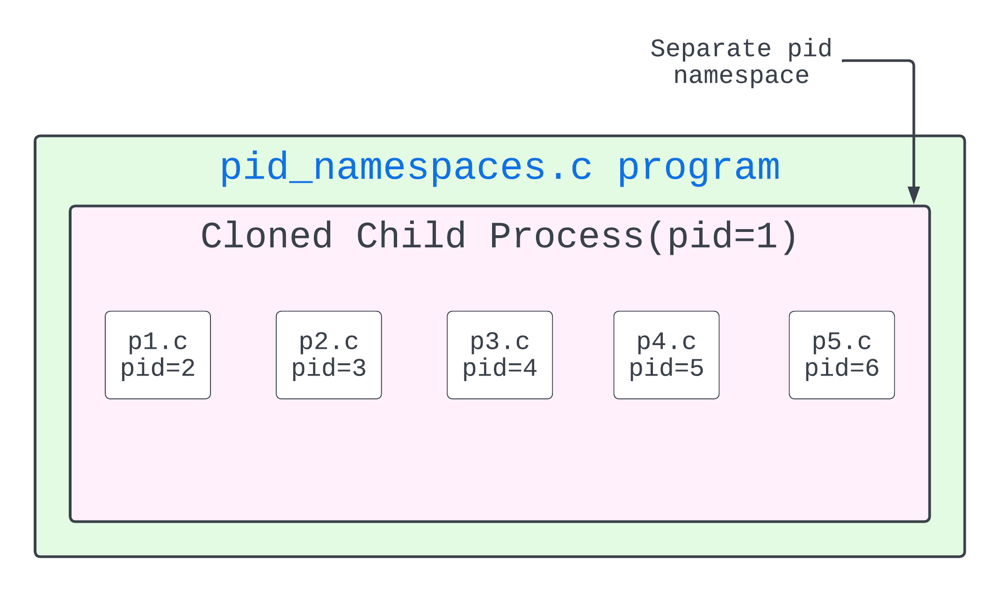
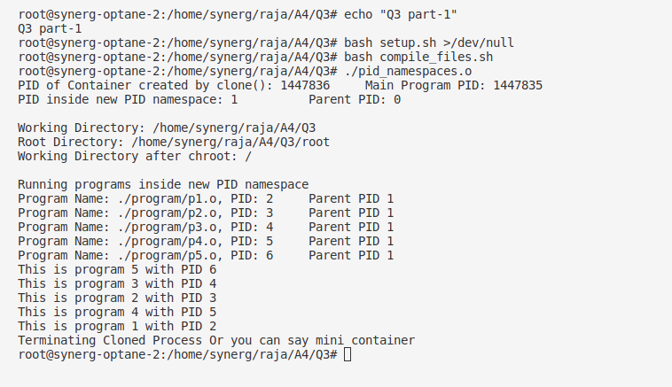
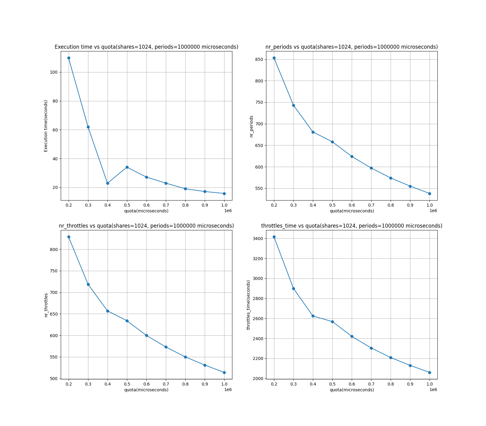

### Q3

Part 1


I have created a file called `pid_namespaces.c` which creates a new child process with different pid namespaces using `clone`. The child process is created with `CLONE_NEWPID` flag. The parent process waits for the child process to finish and then exits. 

The child process change its root directory to './root' using `chroot` and already added all required libraries in the root directory and program is stored in `root/program` directory.

Setup can be automatically done by running `setup.sh` script and then `compile_files.sh` to compile the program. 

Inside the child process after changing the root directory, 5 processes are forked and run the all 5 programs using `exec` system call.


Part 2

```bash
cd Q3
sudo su
[sudo] password for synerg: 
root@synerg-optane-2:/home/synerg/raja/A4/Q3# bash setup.sh >/dev/null
root@synerg-optane-2:/home/synerg/raja/A4/Q3# bash compile_files.sh 
root@synerg-optane-2:/home/synerg/raja/A4/Q3# bash result.sh
```



###### Observations

Part 2:

- `result.sh` and `graph.py` are used to generate the graph.
- pid_namespaces_2.c is used to create the child process with different pid namespaces. It also add the process to the cgroup.
- As we can see in the graph, the execution time of the program is increasing as the number of processes increases. This is because the execution time of the program is proportional to the number of processes.
- As we can see in the graph, increasing quota of the cgroup is decreasing the execution time of the program and similarly for the other metrics as well like throttled time, nr_throttled, nr_periods.
- This is because we are getting more CPU time for the program to execute and hence the execution time is decreasing.
- Same behaviour is observed in the Q1 part 1 as well.